# Tematika

1. Introduction: Software Development Philosophies and Contradictions

**A) Process**

2. Software Lifecycle and Software Development Process
3. Software Development Models (from Waterfall to Agile and Lean)
4. Software Development Methodologies (Scrum, Kanban, XP, TDD, MDD...)
5. User stories, UX, Story-Driven Modeling, UDD, Persona-Scenario-Use case
6. DevOps toolchain: code review, merging, version control, continuous integration, testing, artifact repository, release automation, monitoring
7. Other ways of verification: static analysis, coding conventions, testing levels, issue tracking, profiling

**B) Architecture**

8. Object Oriented Principles, Modelling and Design, SOLID, Shlaer-Mellor method, UML and xtUML
9. Architectural Improvements: Refactoring vs Object Normalization vs Design Patterns (and anti-patterns)
10. Creational, Structural, Behavioral and Concurrency Design Patterns
11. Architectural Patterns: Front Controller, Multitier, Publish-Subscribe, MVC, MVVM, Service Locator, Dependency Injection, IoC, SOA, Peer-to-Peer, REST...


# 1. Introduction: Software Development Philosophies and Contradictions
Lectures:
- Semester 1st part: The Process, Software Development Models, Methodologies and Tools
- Semester 2nd part: The Architecture, Architectural Improvements, Design Patterns


# 2. Software Lifecycle and Software Development Process
What is software?
- Product - Assembly line
- Service - SaaS
- Infrastructure - Open source

### Software/System Development Life Cycle (SDLC)
1. Initiation
1. System Concept Development
1. Planning
1. Requirements Analysis
1. Design
1. Development
1. Integration and Test
1. Implementation
1. Operations & Maintenance
1. Disposition

### Testing
Any of Black Box Testing, White Box Testing and Gray
Box Testing methods can be used

1. Unit testing
1. Integration (+interface) testing
1. System testing
1. Acceptance testing: Internal (&alpha;) / External (&beta;) testing

### Work Breakdown Structure - WBS
Collecting the tasks (and subtasks) that needs to get done.

Tere are two types of WBS:
1. Deliverable-Based (by features) &larr; most common and preferred
2. Phase-Based (planning, execution, closeout)

The main difference between the two approaches are the
Elements identified in the first Level of the WBS.

How to Use a WBS?
1. Initially, it serves as a planning tool
1. The WBS is also used as the primary source of schedule and cost estimate
activities
1. As a description of all the work and as a monitoring and controlling tool &larr; **most important**

# 3. Software Development Models (from Waterfall to Agile and Lean)
## Development Models
### Waterfall
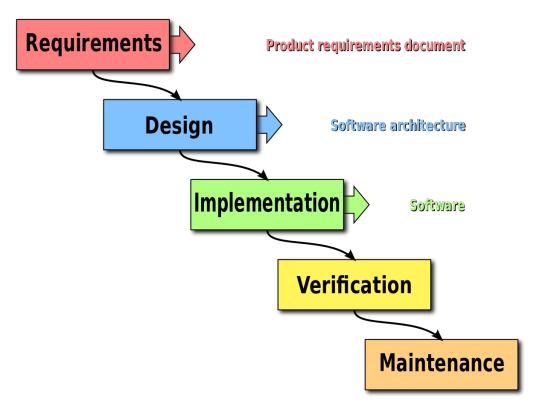

1. **Requirements**: project scope, stakeholder expectations, research (e.g., market), assemble team, kickoff (meeting)
2. **Design**: collect tasks (WBS diagram), create schedule (Gantt diagram)
3. **Implementation**: assign team tasks, monitor, track & trace, manage resources, report to stakeholders, test, deliver application
4. **Verification**: pay contracts, create template, close out paperwork, celebrate
5. **Maintenance**: This is an ongoing, post-launch phase that extends for as long as your contract dictates

Pitfalll: If something is not understood well. Too rigid, cannot handle problems

### V-model
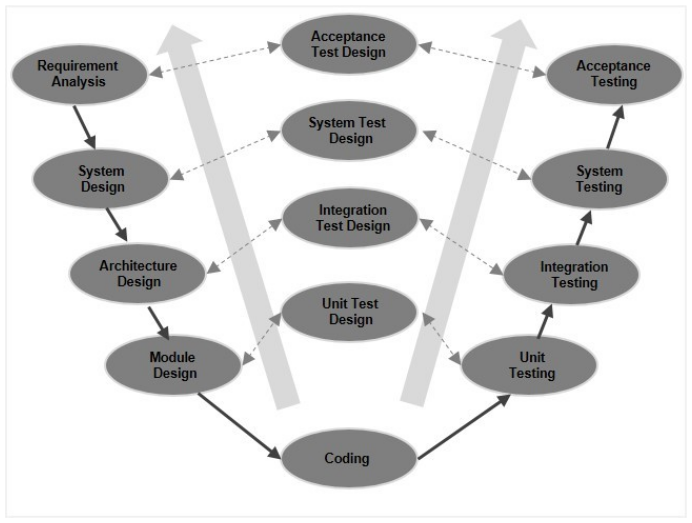
- Modified Waterfall
- Has different Levels of Abstraction
- Pairs development and testing phases (but do not unifies them)

The disadvantage is that the model is not flexible to changes

### Software Prototype Model
- Iterative approach
- Prototyping can be:
  - Throwaway
  - Evolutionary (prototype becomes product)
  - Merging (or Incremental)

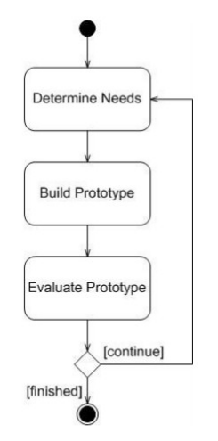

Pros:
- fast
- quick
- quick feedback

Cons:
- no planning &darr;
- too many iterations
- devs dislike throwing away code
- devs don't see long term goals

### Iterative / Incremental Model
Starts with a simple implementation of a subset of the requirements and iteratively improves until it is implemented.

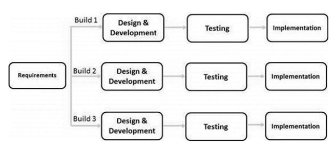

Pros:
- With every increment, operational product is
delivered
- Parallel development
- Less costly to change
- Testing is easy
- Risks are identified and resolved during iteration

Cons:
- More resources may be required
- More management attention is required
- End of project may not be known
- System architecture or **design issues may arise because not all requirements are gathered** in the beginning of the entire project

### Spiral Model
Waterfall + Prototyping + Iterative (Incremental)

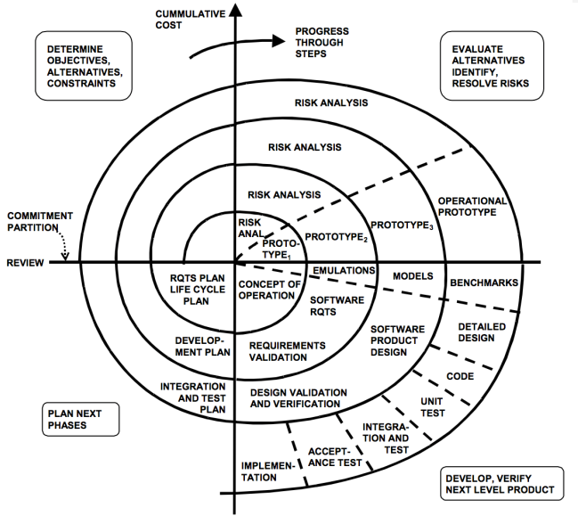

### RAD Model (Rapid Application Development)
Made for GUI and information systems

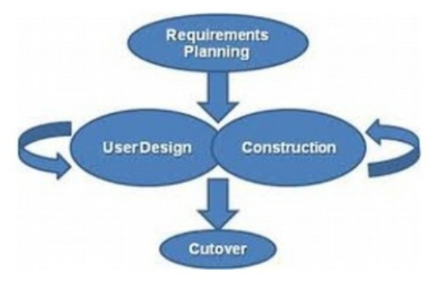

## Software Development Tools
### Time Management Matrix
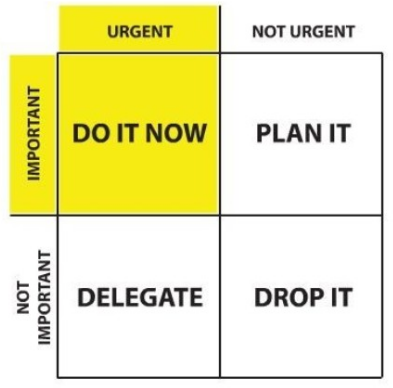


# 4. Software Development Methodologies (Scrum, Kanban, XP, TDD, MDD...)

## Agile process
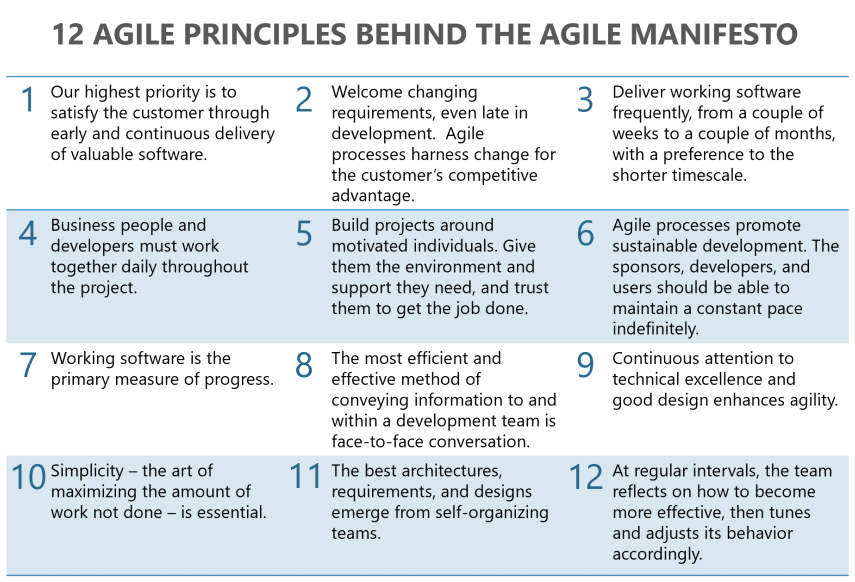
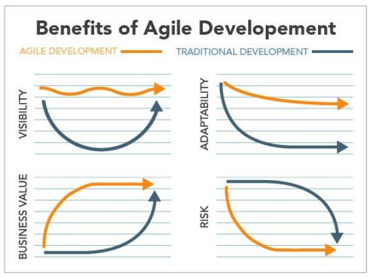

## Agile methodologies
### XP – eXtreme Programming
- Manage a smaller team
- Are in constant contact with your customers
- Have an **adaptable** team that can embrace change
- Are well versed in the technical aspects of coding

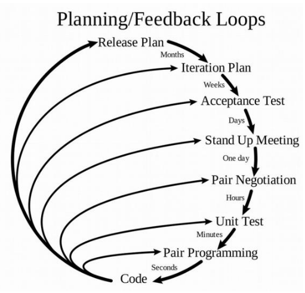

### Test-driven development (TDD)
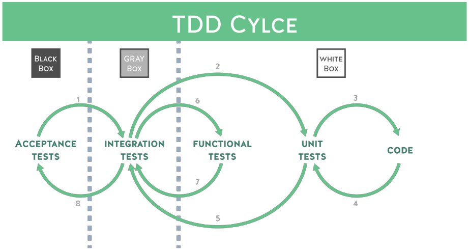

### Behavior-driven Development (BDD)
- Behavioral specifications: user story
- Tools: Cucumber + Gherkin

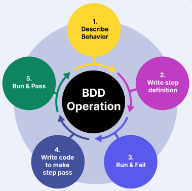

### Feature Driven Development (FDD)
- driven from a client-valued functionality
- Its main purpose is to deliver working software repeatedly in a timely manner in accordance with the Principles behind the Agile Manifesto
- bottom-up approach

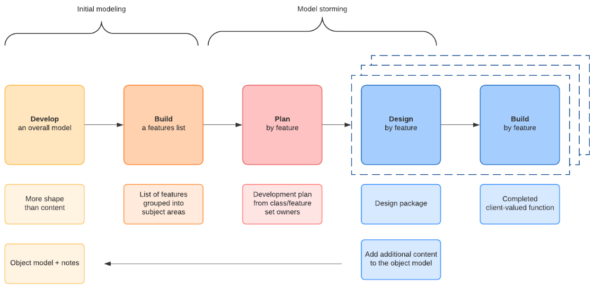

### Scrum
Scrum is a collection of meetings, roles and tools that work together to help teams to better structure and manage their workload.

Based on agile mindset:

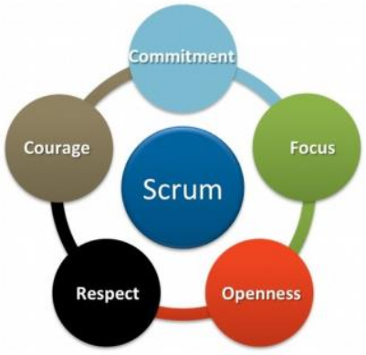

Scrum is a framework to practise using the agile mindset:

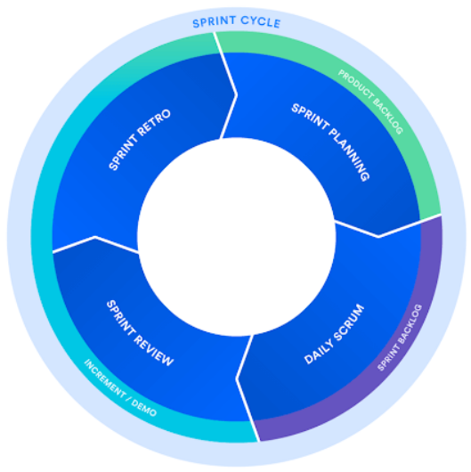

Scrum artifacts:
1. Product Backlog - master list of work
2. Sprint Backlog &larr; sprint planning
3. Increment (or Sprint goal) - definition of “Done”

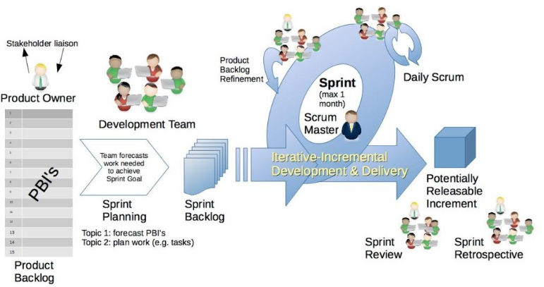

Quick releases keep the team motivated and the users happy!

### Kanban
- Not as structured as scrum
- Developed at Toyota

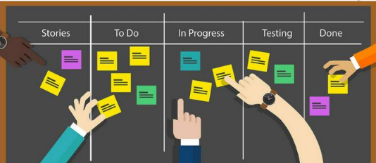


# 5. User stories, UX, Story-Driven Modeling, UDD, Persona-Scenario-Use case
UX process
- Who is using it? (visual design)
- What are they trying to do? (strucutral desing, organization)
- How is it working? (usability, integration)

UX practices
- wireframing
- GUI mockup (less then proto)
- prototyping
- flowchart: workflow
- personas: `Persona = Person + Activity` to represent the different user types
- Scenarios (functional requirements): use-cases, user stories
- A/B testing


# 6. DevOps toolchain: code review, merging, version control, continuous integration, testing, artifact repository, release automation, monitoring
- VCS
- Branching, code review
- CI/CD: build, test, release, package, depoly, monitor
- automation

# Lectures branch off
Original plan:

7. Other ways of verification: static analysis, coding conventions, testing levels, issue tracking, profiling
8. Object Oriented Principles, Modelling and Design, SOLID, Shlaer-Mellor method, UML and xtUML
9. Architectural Improvements: Refactoring vs Object Normalization vs Design Patterns (and anti-patterns)
10. Creational, Structural, Behavioral and Concurrency Design Patterns
11. Architectural Patterns: Front Controller, Multitier, Publish-Subscribe, MVC, MVVM, Service Locator, Dependency Injection, IoC, SOA, Peer-to-Peer, REST...

Actual lectures:

7. OOP Principles, Refactoring, Modeling, Dependency Injection
8. Design Patterns (Part I), Frontend Architecture


# 7. OOP Principles, Refactoring, Modeling, Dependency Injection
## OOP
(Not everything can be solved by inheritance &rarr; Composition over inheritance)

### OOP tools
- Classes, Objects…
- Composition or inheritance or delegation?
- Dynamic dispatch (late binding) or **message passing**
- What about static (parametric) polymorphism? (templates)
- Goals
- Reusability
- Maintainability
- Support teamwork
- Design Patterns
- Control flow vs Data flow
- Responsibility-driven Design
- Data-driven Design

#### Dynamic dispatch = Polymorphism
```java
class Parent {
    public void method() {...}
}
class Child {
    @Override
    public void method() {...}
}

// static type: Panent
// dynamic type: Child
Parent instance = new Child();
instance.method(); // calls Child's implementation
```

#### Message passing


### SOLID principles
- **S** - Single Responsibility Principle
- **O** - Open/Closed Principle
- **L** - Liskov Substitution Principle
- **I** - Interface Segregation Principle
- **D** - Dependency Inversion Principle

### Refactoring &larr; **!!! IMPORTANT !!!**
### Class Normalization
### Design Patterns

### OOA (Object-Oriented Analysis)
### UML (Unified Modeling Language)

## Dependency Injection


# 8. Design Patterns (Part I), Frontend Architecture
